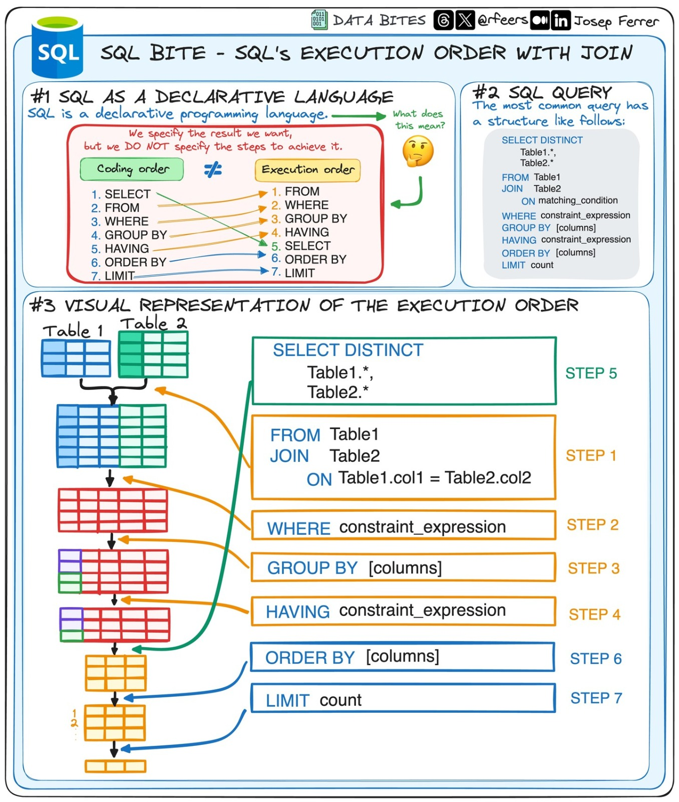

# 📚 Siglas em SQL: DDL, DML, DQL, DTL e DCL

[⬅️ Voltar ao Sumário](../README.md#-sumário)

No mundo dos bancos de dados relacionais, o **SQL (Structured Query Language)** é dividido em subconjuntos de comandos, cada um com um propósito específico.  
Esses subconjuntos são conhecidos pelas siglas: **DDL, DML, DQL, DTL e DCL**.

---

## 🔹 1. DDL – Data Definition Language (Linguagem de Definição de Dados)
Usada para **definir a estrutura do banco de dados**, como tabelas, índices e relações.

Exemplos de comandos:
- `CREATE` → cria tabelas, bancos de dados, índices, views.  
- `ALTER` → modifica tabelas ou colunas existentes.  
- `DROP` → exclui tabelas, bancos de dados ou objetos.  
- `TRUNCATE` → apaga todos os registros de uma tabela, mas mantém a estrutura.  

---

## 🔹 2. DML – Data Manipulation Language (Linguagem de Manipulação de Dados)
Responsável por **inserir, alterar e remover dados** dentro das tabelas.

Exemplos de comandos:
- `INSERT` → insere novos registros.  
- `UPDATE` → atualiza registros existentes.  
- `DELETE` → remove registros.  
- `MERGE` → insere ou atualiza dependendo da condição (suportado em alguns SGBDs).  

---

## 🔹 3. DQL – Data Query Language (Linguagem de Consulta de Dados)
Usada para **consultar dados** armazenados nas tabelas.  
Embora seja comum incluir o `SELECT` dentro de DML, alguns autores destacam DQL como categoria separada.

Exemplo:
- `SELECT` → consulta e retorna dados das tabelas.  

---

## 🔹 4. DCL – Data Control Language (Linguagem de Controle de Dados)
Responsável por **controlar permissões e segurança** no banco de dados.

Exemplos de comandos:
- `GRANT` → concede privilégios a usuários ou roles.  
- `REVOKE` → remove privilégios concedidos.  

---

## 🔹 5. DTL (ou TCL) – Data Transaction Language (Linguagem de Transação de Dados)
Usada para **gerenciar transações** dentro do banco, garantindo integridade e consistência.

Exemplos de comandos:
- `BEGIN` / `START TRANSACTION` → inicia uma transação.  
- `COMMIT` → confirma as alterações feitas.  
- `ROLLBACK` → desfaz as alterações caso haja erro.  
- `SAVEPOINT` → cria pontos de restauração dentro da transação.  

---

## 🔎 Sequência de execução de uma query SQL

Embora escrevemos uma query SQL nessa ordem:

```sql
SELECT ...
FROM ...
JOIN ...
WHERE ...
GROUP BY ...
HAVING ...
ORDER BY ...
LIMIT ...
```

➡️ O banco de dados **executa internamente em outra ordem**:

1. **FROM** → identifica as tabelas ou subconsultas.  
2. **JOIN** → realiza junções entre tabelas.  
3. **WHERE** → aplica filtros linha a linha.  
4. **GROUP BY** → agrupa os dados.  
5. **HAVING** → filtra os grupos criados.  
6. **SELECT** → escolhe as colunas/expressões a serem retornadas.  
7. **DISTINCT** → elimina duplicados (se usado).  
8. **ORDER BY** → ordena o resultado.  
9. **LIMIT / OFFSET / TOP** → limita a quantidade de linhas retornadas.  

---

## 🛠️ Como o SQL otimiza internamente

1. **Parsing** → traduz sua query em uma árvore de operações.  
2. **Reescrita** → remove redundâncias, aplica simplificações.  
3. **Otimização** → escolhe os melhores algoritmos (join, sort, group, index scan vs. seq scan).  
4. **Plano de execução** → decide a ordem e métodos.  
5. **Execução real** → lê dados, aplica filtros, agrupa, ordena, retorna.  

📌 É por isso que:  
- Não é possível usar alias do `SELECT` dentro do `WHERE` (porque o `WHERE` executa antes).  
- Mas é possível usar alias no `ORDER BY` (porque ele vem depois do `SELECT`).  

---

## 📊 Diagrama da ordem de execução

A imagem abaixo mostra de forma visual o fluxo lógico de execução de uma query SQL:



---

## 🚀 Resumindo
- **DDL** → estrutura (tabelas, colunas, índices).  
- **DML** → manipulação (inserir, atualizar, excluir dados).  
- **DQL** → consultas (`SELECT`).  
- **DCL** → permissões e segurança.  
- **DTL/TCL** → transações (commit, rollback).  
- **Ordem de execução**: `FROM → WHERE → GROUP BY → HAVING → SELECT → DISTINCT → ORDER BY → LIMIT`.  

Essas divisões e a ordem de execução ajudam a entender melhor como o banco processa comandos SQL.

---
